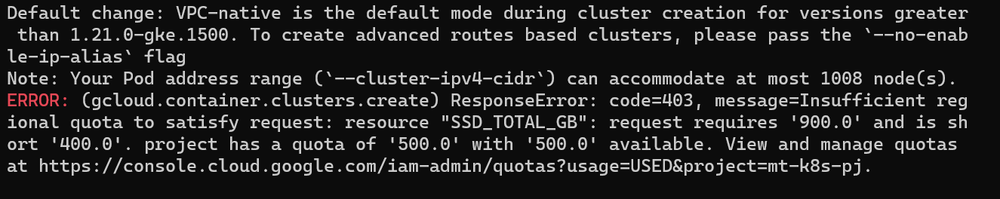

# GKE

## CLI
GCPのCLIが利用可能
コマンドベースでGCPのリソースの作成・更新・削除などが可能

```
$gcloud config list
> default config

# gcpではすべてのリソースがいづれかのPJに属する必要がある
# デフォルトのPJを設定する
$gcloud config set project [pj-id]
>Updated property [core/project]
```

## create cluster

```
# create autopilot cluster
gcloud container clusters create-auto gke-handson --location=asia-northeast1
```
**autopilotモード**
GKEクラスタのノード、インフラをGoogle側で管理するマネージドなクラスタ

通常の作成コマンドの場合、自身でノードのサイズなどを設定する必要がある。

参考）
GCP無償枠ではSSD_TOTAL_GBの制限があり、必要となる900GBを用意できないためエラーとなる。
```
$gcloud container clusters create <cluster-name> --location=asia-northeast1
```


このため、無償枠でコマンドライン経由のクラスタ作成時にはautopilotモードにて作成する必要がある。（オプションによって制御が可能かもしれないが未調査）

# kubernetes

## Deployment


## Service
